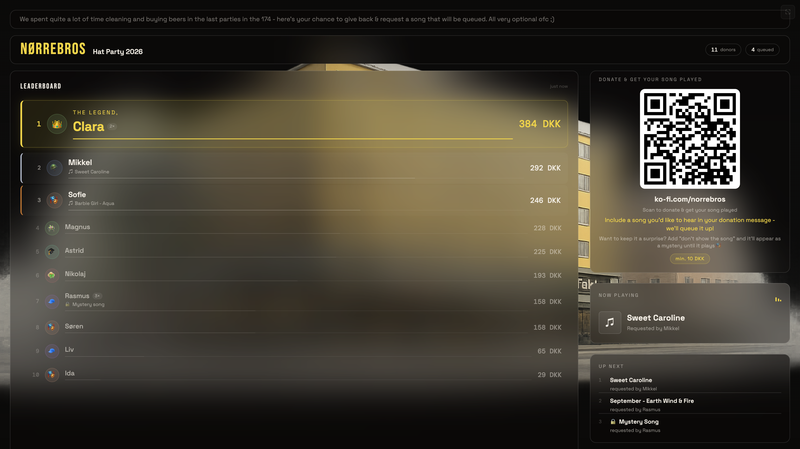
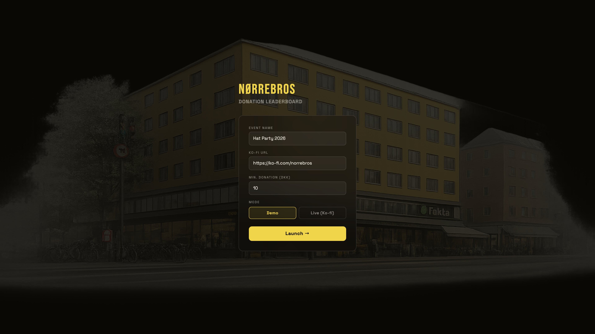

# Digital Jukebox

A party jukebox where guests pay to queue songs - and the live leaderboard shows who is bankrolling the playlist.

Guests scan a QR code on the venue screen, donate a few kroner with a song request in the message, and an LLM reads the request and drops the track straight into the Spotify queue. Their name climbs the leaderboard for the whole room to see. The host keeps the money.

## The story

This ran live at a real party in Copenhagen ([Hat Party 2026, Nørrebro]). [~N] guests, one laptop, one venue screen. The QR code went up, the first donation landed, and the leaderboard did the rest: as soon as people saw someone else's name at #1 with a golden crown, they paid to take it back. Song requests came in as free-text donation messages - "play Dancing Queen", "🎵 Africa - Toto", "surprise me, don't show the song" - and the system parsed and queued all of them without anyone touching the laptop.

By the end of the night it had earned [X DKK]. Not a demo, not a portfolio piece that never left localhost - it ran for hours in front of a room of people who were actively trying to out-donate each other.

## How it works

```
guest phone                 laptop (this app)                    big screen
    │                            │                                   │
    │  scan QR → pay on Ko-fi    │                                   │
    ├───────────────────────────►│                                   │
    │                            │  Ko-fi webhook → POST /webhook/kofi
    │                            │  LLM extracts song from message   │
    │                            │  (Gemini 2.0 Flash, GPT-4o-mini   │
    │                            │   fallback)                       │
    │                            │  Spotify API queues the track     │
    │                            ├──────────────────────────────────►│
    │                            │   leaderboard + announcement      │
```

1. **Pay** - guest scans the on-screen QR code and donates through Ko-fi, writing their song wish in the donation message.
2. **Parse** - the webhook fires, and an LLM extracts song + artist from whatever phrasing the guest used, in any language. "Surprise me" requests get flagged as hidden.
3. **Queue** - the track is searched on the Spotify Web API and added to the live playback queue. Hidden songs show as "mystery song" until they start playing.
4. **Compete** - every donation triggers a full-screen announcement; a new #1 gets "The Legend" treatment. Donors are ranked by running total in DKK (multi-currency, converted).
5. **Detect** - a poller watches Spotify's now-playing and auto-marks requested songs as played when they come on.

Everything is in-memory - no database. One `DELETE /api/donations` resets the night.

## Stack

| Layer | Tech |
|---|---|
| Frontend | React 18, Vite 5 |
| Backend | Node.js (ESM), Express 4 |
| Payments | Ko-fi webhook (multi-currency: DKK, EUR, USD, GBP, SEK, NOK) |
| Song extraction | Gemini 2.0 Flash, GPT-4o-mini fallback |
| Music | Spotify Web API (OAuth, search, queue, now-playing) |
| QR | qrcode.react |

Song extraction cost is close to zero: Gemini 2.0 Flash is free within quota, the GPT-4o-mini fallback is ~$0.003 per 100 donations.

## Screenshots

**Live leaderboard** - donor ranking, now playing, up next, and the QR panel (shown in demo mode):



**Setup screen** - event name, payment link, minimum donation, demo or live mode:



<!-- PLACEHOLDER: add 1-2 photos from the actual party night (screen in the room, guests scanning) -->

## Run it yourself

```bash
npm install
cp .env.example .env   # fill in your keys
npm run dev
```

- Frontend: http://localhost:5173
- Backend: http://localhost:3000
- Spotify auth: http://localhost:3000/auth/spotify

```env
KOFI_TOKEN=             # Ko-fi webhook verification token
GEMINI_API_KEY=         # tried first for song extraction
OPENAI_API_KEY=         # GPT-4o-mini fallback
SPOTIFY_CLIENT_ID=      # from developer.spotify.com
SPOTIFY_CLIENT_SECRET=
```

**Ko-fi webhook**: expose port 3000 with ngrok, set `https://<your-ngrok-url>/webhook/kofi` at [ko-fi.com/manage/webhooks](https://ko-fi.com/manage/webhooks), copy the verification token into `.env`.

**Spotify**: create an app at [developer.spotify.com](https://developer.spotify.com/dashboard) with redirect URI `http://127.0.0.1:3000/auth/spotify/callback`, then log in once via `/auth/spotify`. Spotify needs an active playback device, and tokens live in memory - re-auth after a server restart.

**Demo mode** needs no keys at all: it generates realistic donations with song requests so you can see the whole thing move before wiring up payments.

## API

| Method | Path | Description |
|---|---|---|
| `POST` | `/webhook/kofi` | Ko-fi donation webhook |
| `GET` | `/api/donations` | All donations |
| `POST` | `/api/donations/:id/played` | Mark a song as played |
| `DELETE` | `/api/donations` | Clear the night |
| `GET` | `/api/spotify/status` | Connection status |
| `GET` | `/api/spotify/queue` | Now playing + next tracks |
| `GET` | `/auth/spotify` | Start Spotify OAuth |
